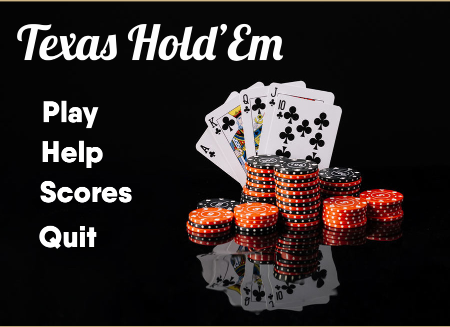

# Texas-Hold-Em

Texas Holdem Game thats 2 players (but requires both to be on the same computer)

Player that earned the most money in one sitting (past earnings of playthroughs stack if player keeps playing). 
Information of players are stored in a pickle array (if they have played at least once) and top players are displayed in a leaderboard format.

## Starting Screen

Game starts here, you can go to the rules if you're unsure how to play Texas Hold'em

## Rule Page

## Before you Play
Before you can start the game you first need to input ID, first name and last name.

## During Game
You have the option to fold, check and raise

## After the Game
At the end of the game, the player who has the greater hand or the one who doesnt fold wins, and their names are put on the leaderboard

## Leaderboard

